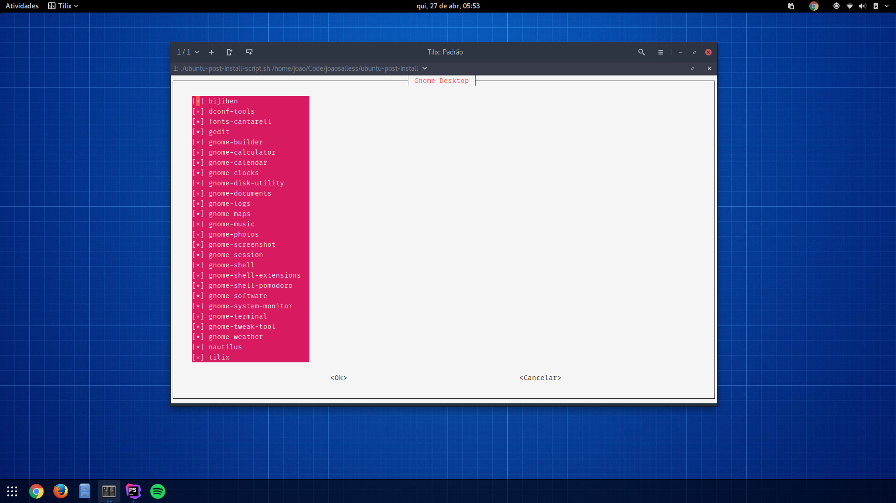
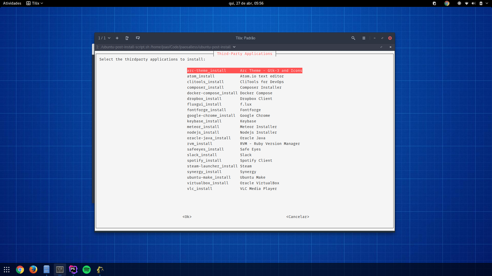

Ubuntu Post Install Scripts
===========================

Original Author: [Sam Hewitt](https://github.com/snwh)

> This project is my set of post-installation and maintenance scripts for Ubuntu, to run on a fresh install. It's designed to install your favourite applications, set your preferred settings, etc. mostly automatically. 

Feel free to fork this project, modify to suit your preference, and distribute.

## Structure

This project is coded and organized in a modular fashion so you can easily delete or exclude parts that you don't want to use.

 * [`data/installs`](/data): this folder contains files which are lists of packages read by various functions. It's recommended to update these to suit your preferences.
 * [`functions`](/functions): this folder contains bash files which are the main functions of this scriptset. They should require little modification.
 * [`functions/install/third-party`](/functions/third-party): this sub-directory contains further bash files that are functions for the installation of third-party applications &ndash;i.e. those that aren't necessarily in the main repositories.

## Usage

Modify the files according to your needs by following this example:
- Add the necessary `PPAs` in the file `ppas.list
- Add the installable applications by the `apt-get` command in the `apps_apt.list` file
- Add the applications installable by the `pip` command in the `apps_pip.list` file
- Add the installable applications by the `npm` command in the `apps_npm.list` file
- Add the applications installable by the `gem` command in the `apps_gem.list` file
- Add the applications installable by the `composer` command in the `apps_composer.list` file
- Add the `third-party` apps in the `apps_thirdparty.list` file

Adjust the `install_name` and commands used by each installer in the `setup.ini` file.

**Important:** The section of each .ini file in the `data/installs/*` directory should be identical to the relative path of the folder where the file is located.

Example for `data/installs/single/favorites` file:

```ini
[data/installs/single/favorites]
install_name="Favorite Applications"
cmd_apt="sudo apt-get install -y --no-install-recommends"
cmd_gem="sudo gem install"
cmd_npm="sudo npm install -g"
cmd_pip="sudo pip install"
cmd_composer="composer global require"
```

`install_name` is required to set the installation name.

`cmd_apt`, `cmd_gem`, `cmd_npm`, `cmd_pip` and `cmd_composer` are optional.

Run the main script from the root of the source folder:

```bash
./ubuntu-post-install-script.sh
```

Or you can store this scriptset in some directory, and add that location to your custom shell paths to run on-demand. For example, adding it as the following line to your `.bashrc` (editing the path appropriately):

```bash
export PATH=${PATH}:$HOME/scripts/ubuntu-post-install/
```

### Screenshot




